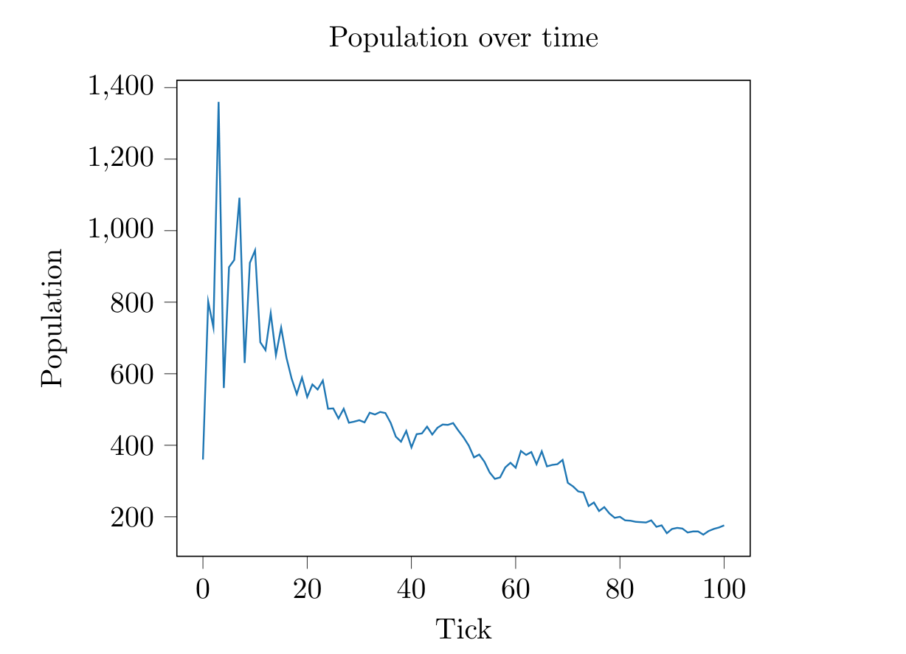

Conway's game of life. Usage:

	$ ./a.out [FILE] [SPEED] [TICKS]

To load Gosper's gun from the seed directory and run at 100ms per tick for 1000 ticks:

	$ ./a.out seeds/gosper.cell 100 1000

A random seed can also be generated. A second argument must be suplied for the distribution factor.

	$ ./a.out random 2 100

2 is the highest distribution and 99 is the lowest.

# Custom Seeds
The simulator takes in ``.cell`` files which store the starting generation. They are formatted like this:

	0......................
	........0...0..........
	............0..........
	.........0.......000...
	.........0..0..........
	..0......0.............
	.000.....0.............
	.000...00........000...
	..0.....0..............
	......0..000...........
	...0.0....0..0..0......
	...0.0..0......0.......

Where 0 is a living cell and '.' is a dead cell.

# Graphing
Once the simulation is finished, a ``.csv`` file with the population at each tick will be outputted. These data can then be graphed using a Python script.

	$ python3 scripts/graph.py

The graph will be shown in a window and then converted into LaTeX, outputting a ``.tex`` file.

You can also run:
	
	$ make graph

# Getting More Patterns
Patterns can be retrieved from the wiki using the script in ``scripts/getcell``. It takes in one argument, that being the name of the pattern, downloads it from the wiki, and does some conversions to make it work with the simulator.
	
	$ cd seeds
	$ ../scripts/getcell blinker

To download the blinker pattern
